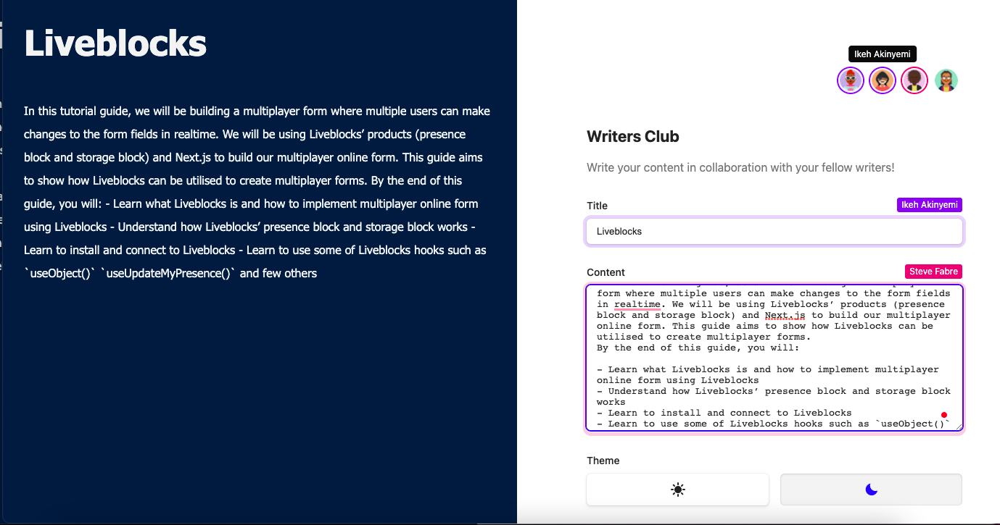

  

# [Liveblocks](https://liveblocks.io) × [Next.js](https://nextjs.org/).

This repo shows how to use the Storage block and [Next.js](https://nextjs.org/).

> :warning: **This demo will not work if you don't have access to the private beta. Please contact us at hello@liveblocks.io if you want access to the storage block private beta**

## Getting started

### Run examples locally

- Install all dependencies with `npm install`

- Create an account on [liveblocks.io](https://liveblocks.io/dashboard)

- Copy your secret key from the [administration](https://liveblocks.io/dashboard/apikeys)

- Create a file named `.env` and add your Liveblocks secret as environment variable `LIVEBLOCKS_SECRET_KEY=sk_test_yourkey`
